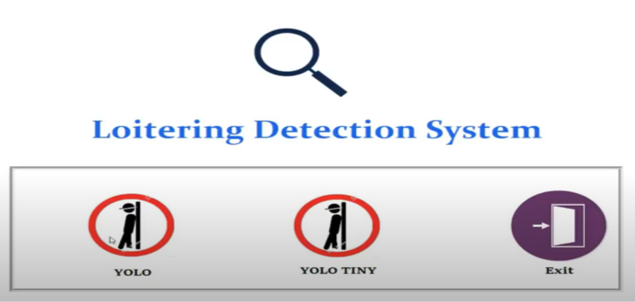
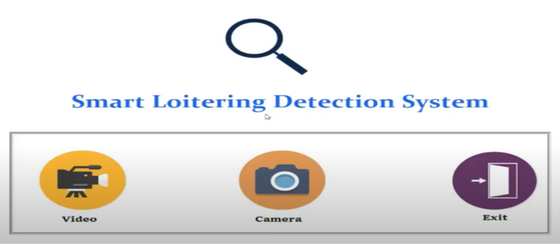
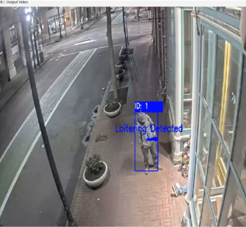
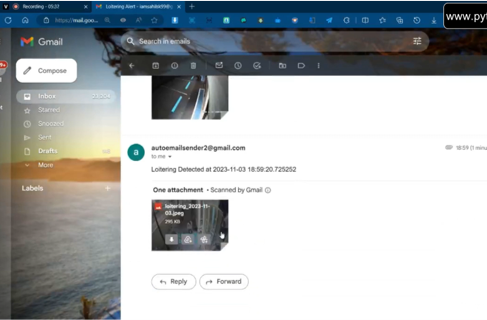
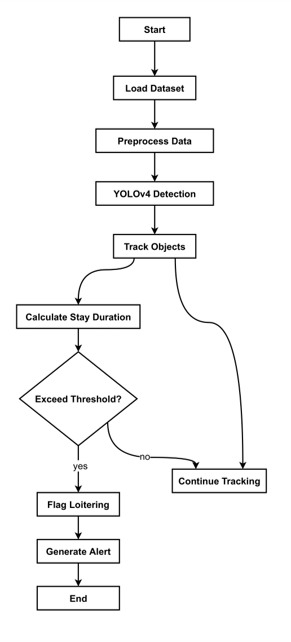

# Detection of Suspicious Loitering Using Deep Learning 🚨👀

## Team Members# 🚨 Detection of Suspicious Loitering Using Deep Learning 👀

## 👥 Team Members
- **Shaik Anas** - (20N31A12E3)
- **Shaik Mohammed Faiyaz Khan** - (20N31A12E4)
- **Yata Goutham** - (20N31A12H1)

### 🎓 Guide
- **Mr. Munnangi Vazralu**, Associate Professor, MRCET - IT Dept

---

## 📅 Agenda
- **Introduction**
- **Methodology**
- **Implementation**
- **Conclusion**
- **References**

---

## 🌟 Project Glimpse

Here are some snapshots of our project in action:

1. **Login Screen:** Secure login for registered users.  
   

2. **Registration Page:** Easy sign-up for new users.  
   

3. **YOLO Selection:** Choose between YOLO and YOLO Tiny models for detection.  
   

4. **Video/Camera Feed:** Browse video files or connect a camera for live detection.  
   

5. **Real-Time Detection:** Detect and monitor loitering in real-time with bounding boxes.  
   

6. **Email Alerts:** Automated email alerts for suspicious activity.  
   

---

## 📜 Introduction
**Project Description:**  
Automated loitering detection using YOLOv5 enhances security in public spaces, providing scalable, real-time monitoring and alerting for efficient surveillance.

### Key Features
- 🚨 **Smart Surveillance Solution**
- 👁️ **YOLOv5 Security System**
- 🖥️ **Scalable Object Detection**
- ⚙️ **Customizable Loitering Monitoring**

---

## 💻 Software Requirements
- **Operating System:** Windows (7, 8, 10, 11)
- **Programming Language:** Python
- **Front-end:** HTML, CSS, JavaScript
- **Back-end:** Firebase

## ⚙️ Hardware Requirements
- **Processor:** Minimum 1 GHz; Recommended 2 GHz or more
- **Network:** Ethernet connection (LAN) or Wi-Fi
- **Hard Drive:** Minimum 32 GB; Recommended 64 GB or more
- **Memory (RAM):** Minimum 1 GB; Recommended 4 GB or above

---

## 🔧 Software Requirement Specification

### Functional Requirements
1. 🕵️ Object Detection
2. 🧠 YOLOv5 Integration
3. 🎯 Tracking Objects
4. 🚦 Loitering Identification
5. 📬 Alert Triggering

### Nonfunctional Requirements
1. ⚡ Performance Metrics
2. 🎛️ Parameter Tuning
3. 🕒 Duration Defaults
4. 💸 Cost-effectiveness
5. 📈 Scalability and Integration

---

## 🔍 Existing System vs Proposed System
| Existing System | Proposed System |
|-----------------|-----------------|
| Basic Surveillance System | Advanced Loitering Detection System |
| Limited Object Recognition | YOLOv5 Object Detection |
| Lacks Duration Estimation | Duration Estimation |
| Basic Video Analytics | Multi-task Training for Real Scenarios |

---

## 🛠️ Methodology


### Key Libraries Used:
- **YOLOv5:** Real-time object detection
- **Kalman Filtering:** Tracks objects frame-by-frame
- **OpenCV:** Processes images and videos
- **Yagmail:** Sends email alerts
- **NumPy:** Handles numerical data

---

## 🔄 Procedure

Here's how our system works step-by-step:

1. **User Login** 🗝️: Existing users log in to access features.  
2. **User Registration** ✍️: New users sign up with an easy process.  
3. **Select Detection Model** 📷:
   - Choose between YOLO or YOLO Tiny models for optimized detection.
4. **Upload Video or Connect Camera** 🎥:
   - Upload a video or connect to a camera for real-time analysis.
5. **Detection and Tracking** 🕵️‍♂️:
   - The system detects and monitors loitering behavior, marking individuals with bounding boxes.
6. **Alerting** 📧:
   - Alerts are sent to registered emails if suspicious loitering is detected.

### 📝 Instructions to Run
To run the project, use this command:
```bash
python start.py

- **Shaik Anas** - (20N31A12E3)
- **Shaik Mohammed Faiyaz Khan** - (20N31A12E4)
- **Yata Goutham** - (20N31A12H1)

### Guide:
Mr. Munnangi Vazralu, Associate Professor, MRCET - IT Dept

---

## 📅 Agenda
- **Introduction**
- **Methodology**
- **Implementation**
- **Conclusion**
- **References**

---

## 📜 Introduction
**Project Description**  
Automated loitering detection using YOLOv5 enhances security in public spaces, offering scalable surveillance with customizable criteria for efficient monitoring, alerting, and investigation.

### Key Features
- Smart Surveillance Solution
- YOLOv5 Security System
- Scalable Object Detection
- Customizable Loitering Monitoring

---

## 💻 Software Requirements
- **Operating System:** Windows (7, 8, 10, 11)
- **Programming Language:** Python
- **Front-end:** HTML, CSS, JavaScript
- **Back-end:** Firebase

---

## ⚙️ Hardware Requirements
- **Processor:** Minimum 1 GHz; Recommended 2 GHz or more
- **Network:** Ethernet connection (LAN) or Wi-Fi
- **Hard Drive:** Minimum 32 GB; Recommended 64 GB or more
- **Memory (RAM):** Minimum 1 GB; Recommended 4 GB or above

---

## 📋 Software Requirement Specification
### Functional Requirements
1. Object Detection
2. YOLOv5 Integration
3. Tracking Objects
4. Loitering Identification
5. Alert Triggering

### Nonfunctional Requirements
1. Performance Metrics
2. Parameter Tuning
3. Duration Defaults
4. Cost-effectiveness
5. Scalability and Integration

---

## 🔍 Existing System vs Proposed System
### Existing System
- Surveillance System
- Loitering Detection
- Object Recognition
- Video Analytics
- Security Monitoring

### Proposed System
- Loitering Detection System
- YOLOv5 Object Detection
- Duration Estimation
- Multi-task Training
- Surveillance Scenarios

---

## 🛠️ Methodology


### Python Libraries Used
- **YOLOv5:** Object detection algorithm for real-time detection.
- **Kalman Filtering:** Object tracking across frames.
- **OpenCV:** For image and video processing.
- **Yagmail:** For email automation.
- **NumPy:** Handling numerical data efficiently.

---

## 🔄 Procedure
1. **User Login:** Allows registered users to log in.
2. **User Registration:** Enables new users to create an account.
3. **Loitering Detection Module:**
   - Select YOLO or YOLO Tiny.
   - Browse video or camera.
   - Alerts sent to registered email.

---

### Instructions to Run
To run the project, use the following command:
```bash
python start.py
